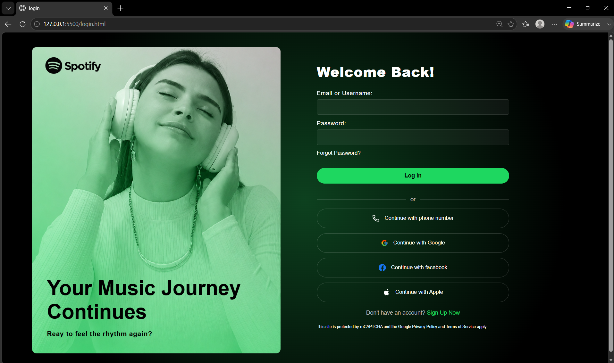
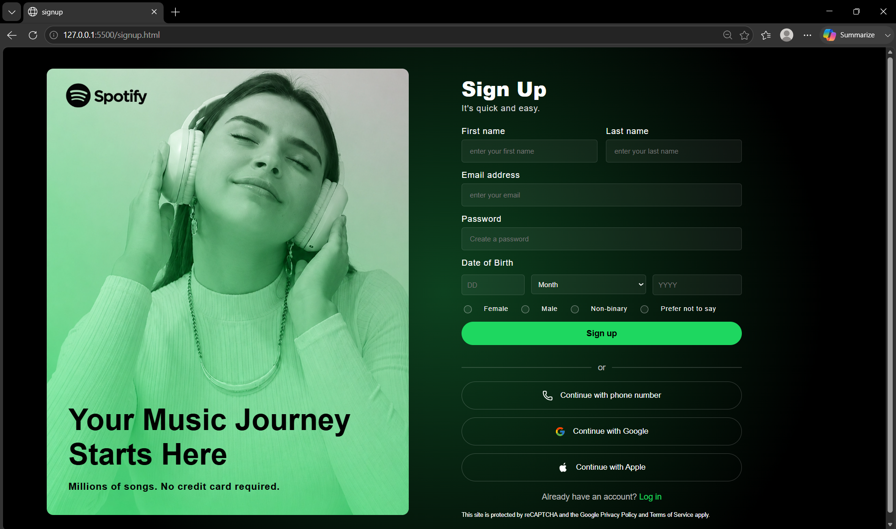

# Login / Signup Page (Spotify Inspired UI)

A responsive login and signup page built using HTML, CSS, and JavaScript. 
This project focuses on form design, basic validation, and clean UI structure.

## Features
- Login and Signup form UI
- Email validation
- Password length validation
- Error messages displayed below input fields
- Responsive design (works on mobile and desktop)
- Clean and modern interface

## Tech Stack
- HTML5
- CSS3
- JavaScript (Vanilla JS)

## Validation Rules
- Email must be in correct format
- Password must be at least 8 characters long

## UI Inspiration
UI design inspired by Dribbble design references. Used only for learning and practice purposes.

## Screenshots
### Login Page

### Signup Page

## How to Run
1. Download or clone the repository
2. Open the folder
3. Run `signup.html` in any browser

## Project Purpose
This project was built for practice to improve frontend development skills, especially form validation and UI design.

## Future Improvements
- Add backend authentication
- Add database integration
- Improve animations and transitions
